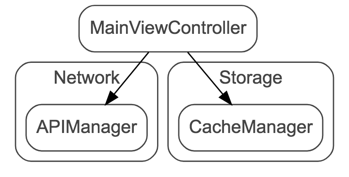
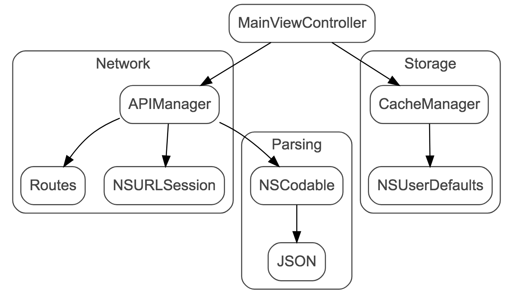
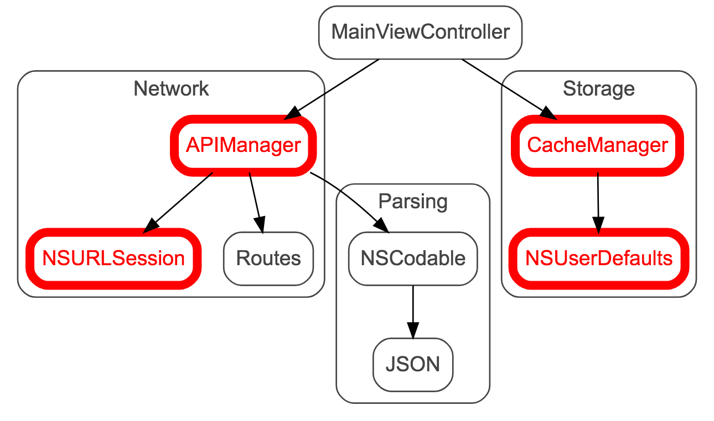

# Versions

## Version with Singletons #1

### Rendered



### Source 

```
digraph G {
    
    bgcolor = white;
 
    fontname = "Arial";
    fontcolor="#444444";
    color="#444444";
    style=rounded; 

    node [
        shape = rectangle; 
        fontname="Arial";
        fontcolor = "#444444";
        color = "#444444"; 
        style=rounded;
    ];

    subgraph cluster_0 {
        label = "Network";

        APIManager;

    }

    subgraph cluster_2 {
        label = "Storage";
    
        CacheManager;
    }

    MainViewController -> APIManager;
    MainViewController -> CacheManager;
}
```

## Version with Singletons #2

### Rendered



### Source 

```
digraph G {

    bgcolor = white;

    fontname = "Arial";
    fontcolor="#444444";
    color="#444444";
    style=rounded; 

    node [
        shape = rectangle; 
        fontname="Arial";
        fontcolor = "#444444";
        color = "#444444"; 
        style=rounded;
    ];

 
  
    subgraph cluster_0 {
        label = "Network";
        
        APIManager -> Routes;
        APIManager -> NSURLSession;

    }

    subgraph cluster_1 {
        label = "Parsing";

        NSCodable -> JSON;
    }

    subgraph cluster_2 {
        label = "Storage";

        CacheManager -> NSUserDefaults;
    }

    MainViewController -> APIManager;
    MainViewController -> CacheManager;

    APIManager -> NSCodable;
}
```

## Version with Singletons #3

### Rendered



### Source 

```
digraph G {

    bgcolor = white;

    fontname = "Arial";
    fontcolor="#444444";
    color="#444444";
    style=rounded; 

    node [
        shape = rectangle; 
        fontname="Arial";
        fontcolor = "#444444";
        color = "#444444"; 
        style=rounded;
    ];

 
  
    subgraph cluster_0 {
        label = "Network";
        
        APIManager [ fontcolor=red; color=red; penwidth=6;]
        NSURLSession [ fontcolor=red; color=red; penwidth=6;]

        APIManager -> Routes;
        APIManager -> NSURLSession;

    }

    subgraph cluster_1 {
        label = "Parsing";

        NSCodable -> JSON;
    }

    subgraph cluster_2 {
        label = "Storage";
    
        CacheManager [ fontcolor=red; color=red; penwidth=6; ]
        NSUserDefaults [ fontcolor=red; color=red; penwidth=6; ]

        CacheManager -> NSUserDefaults;
    }

    MainViewController -> APIManager;
    MainViewController -> CacheManager;

    APIManager -> NSCodable;
}
```

# Credits

Used online Graphviz editor [GraphvizOnline](https://dreampuf.github.io/GraphvizOnline)