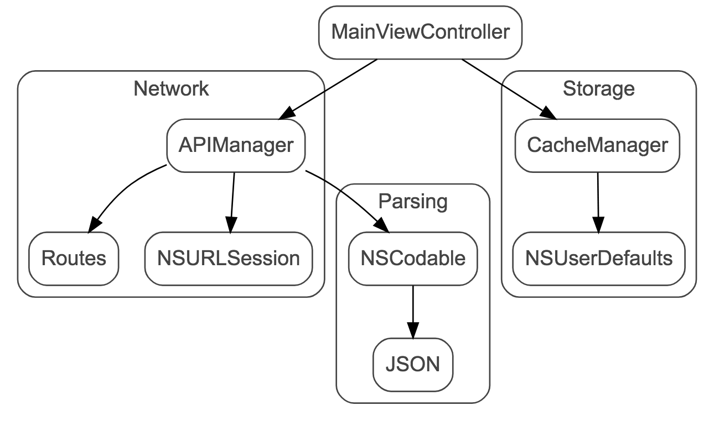

autoscale: true  
slidenumbers: true  
theme: Next, 3

# [fit] 👋 Bye, Singletons [^*]
# [fit] 🙌 Dependency Injection

<br/>

```swift
let author = "Konstantin Portnov"
let github = "github.com/x0000ff"
```

<br/>


[^*]: [https://octodex.github.com/dojocat](https://octodex.github.com/dojocat)

---

# 🧙‍♀️ Show Time


---

# 👨🏻‍💻 Code Time!


---

# Flowchart. Really? 🤔


---

# Flowchart. Reality 🤫



---

# So what's the problem? 😒


---

# 👇 Here they are...

[.code-highlight: 1]
[.code-highlight: 2]
[.code-highlight: 3]
[.code-highlight: 4]
[.code-highlight: 5]
[.code-highlight: 6]

```
- ✅ How to test?
- 🔗 What if we change endpoint names?
- 🚀 Use `production` end `development` environments
- 📦 Migrate from `JSON` to `TomorrowSON`?
- 🚧 How to implement/change it working in a team?
- 🔑 Change cache mechanism from `NSUserDefaults` to `Keychain`
```

---

# 😏 That’s a problem for future me


---

# 😔 OK. I got it. What should I do?


---

# Singleton

> In software engineering, the singleton pattern is a software design pattern that restricts the instantiation of a class to one object. 
-- [Wikipedia](https://en.wikipedia.org/wiki/Singleton_pattern)


---

# Famous singletons

- `(NS)NotificationCenter.default`
- `(NS)UserDefaults.standard`
- `UIApplication.shared`
- `UIDevice.current`

etc...

---

# Tipical implemetation

[.code-highlight: 1-5]
[.code-highlight: 7-9]

```swift
class SomeManager {
    static let shared = SomeManager()
    private init(){ /* ... */ }
    func doWork() { /* ... */ }
}

let manager = SomeManager.shared
manager.doWork()
```

---

# 🎉 Service Locator

```swift
protocol ServiceLocating {
    func getService<T>() -> T?
}
```

---

# 👷‍♂️ Implementation 

[.code-highlight: 1-2, 18]
[.code-highlight: 8-12]
[.code-highlight: 13-16]


```swift
final class ServiceLocator: ServiceLocating {
    private lazy var services: Dictionary<String, Any> = [:]
    
    private func typeName(some: Any) -> String {
        return (some is Any.Type) ? "\(some)" : "\(type(of: some))"
    }
    
    func register<T>(service: T) {
        let key = typeName(some: T.self)
        services[key] = service
    }
    
    func getService<T>() -> T? {
        let key = typeName(some: T.self)
        return services[key] as? T
    }
    public static let shared = ServiceLocator()
}
```

---

# 🤔 How To Use?

[.code-highlight: 1-3]
[.code-highlight: 4]
[.code-highlight: 6-7]
[.code-highlight: 9-10]

```swift
protocol APIService {
    func getBalance(calback: () -> (Balance)) -> Void)?)
}
class WebAPIService: APIService { }

let locator = ServiceLocator()
locator.register(service: WebAPIService() as APIService)

let apiService = locator.getService() as APIService?
apiService?.load(/*... */)
```

---


---

# 👋 Chao, optionals!

[.code-highlight: 1-4]
[.code-highlight: 6-12]

```swift
protocol ServiceLocating {
    var apiService: APIService { get }
    var cacheManager: CacheManager { get }
}

final class ServiceLocator: ServiceLocating {

    var apiService: APIService = WebAPIService()
    var cacheManager: CacheManager = UserDefaultsCacheManager()
    
    public static let shared = ServiceLocator()
}
```

---

# ☺️ Mock me, mock me harder...

```swift
protocol APIService {
    func load(cardNumber: String, 
              completion: ((Result<StatusResponse>) -> Void)?)
}
```

---

# ☺️ Mock me, mock me harder...

```swift
class LocalApiService: APIService {
    func load(cardNumber: String, 
              completion: ((Result<StatusResponse>) -> Void)?) {
        
        let result = (cardNumber == "") ? faulureResult() 
                                        : successResult()
        completion?(result)
    }
}

// See complete implementation in https://github.com/x0000ff/bip-app
```

---

# ☺️ Mock me, mock me hard...

[.code-highlight: 5]

```swift
class AppDelegate: UIResponder, UIApplicationDelegate {

    func application(/* ... */) -> Bool {
       
        ServiceLocator.shared.apiService = LocalApiService()

        return true
    }
}
```

---

# 🤨 But we still use a singleton


---

# 🤨 But we still use a singleton

<br><br><br><br><br><br>

```swift
➡️ ServiceLocator.shared.apiService = MockApiService()
```

---


# 🤨 But we still use a singleton


---

# Responsibility & Coupling


---

# Inversion of Control

---

# Dependency Injection


---

# Simple Dependency Injection

```swift
class MyClass
{
  private let dependency:MyDependency

  init(dependency:MyDependency)
  {
    self.dependency = dependency
  }
}
```

---

# DI actors

Dependency Injection pattern involves 3 types of classes.

- 1. **Client Class**: The client class (dependent class) is a class which depends on the service class


 
---

# DI actors

Dependency Injection pattern involves 3 types of classes.

- 2. **Service Class**: The service class (dependency) is a class that provides service to the client class.


---

# DI actors

Dependency Injection pattern involves 3 types of classes.

- 3. **Injector Class**: The injector class injects service class object into the client class.


 
---

# Types of Dependency Injection

- **Constructor Injection**: In the constructor injection, injector supplies service (dependency) through the client class constructor.


---

# Types of Dependency Injection

- **Property Injection**: In property injection (aka Setter Injection), injector supplies dependency through a public property of the client class.


---


# Types of Dependency Injection

- **Method Injection**: In this type of injection, client class implements an interface which declares method(s) to supply dependency and the injector uses this interface to supply dependency to the client class.


---

# Let's get hands dirty


---

# Show must go on

- [http://www.tutorialsteacher.com/ioc/inversion-of-control](http://www.tutorialsteacher.com/ioc/inversion-of-control)

- [https://github.com/x0000ff/presentation-singletons-and-dependecy-injection](https://github.com/x0000ff/presentation-singletons-and-dependecy-injection)

- [https://github.com/x0000ff/bip-app](https://github.com/x0000ff/bip-app)
- [https://github.com/x0000ff/bip-api](https://github.com/x0000ff/bip-api)

---
# Questions? 🙂


---

# **Me...**


-  Konstantin Portnov 

-  [http://about.me/x0000ff](http://about.me/x0000ff)

-  [https://github.com/x0000ff](https://github.com/x0000ff)

-  [https://twitter.com/x0000ff](https://twitter.com/x0000ff)

-  [https://www.linkedin.com/in/KonstantinPortnov](https://www.linkedin.com/in/KonstantinPortnov)

---

# This Presentation
# 🙂
# https://bit.ly/2Le94P8

---

# Thanks a lot!
# ¡Muchas gracias!
# ¡Moltes gràcies!
# Большое спасибо!

☺️


---

# EOF
# 🍻